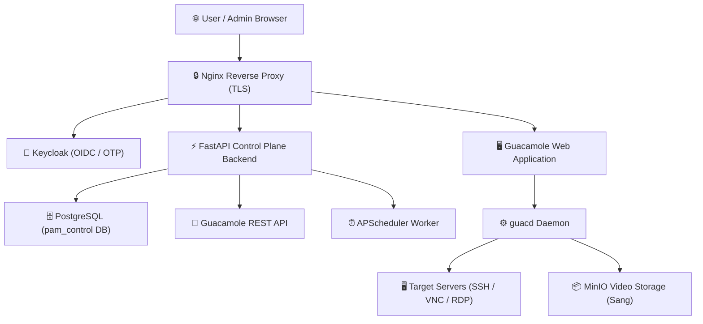
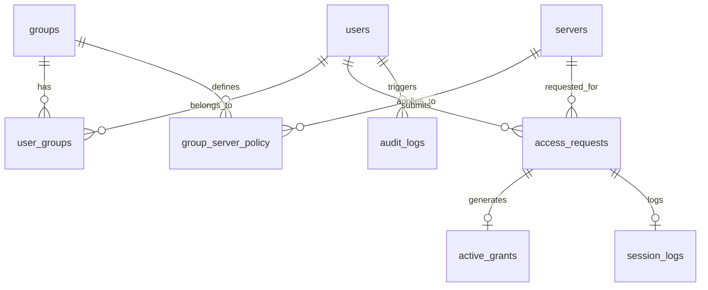
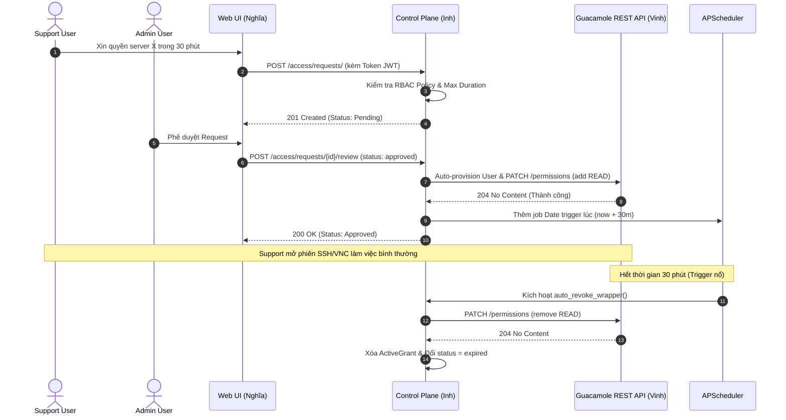

# 📚 Tài Liệu Kỹ Thuật Hệ Thống PAM Gateway
**Privileged Access Management (PAM) — Just-In-Time (JIT) Access Control**

---

## 📋 MỤC LỤC
1. [Giới thiệu & Kiến trúc Tổng quan](#1-giới-thiệu--kiến-trúc-tổng-quan)
2. [Cấu hình Control Plane Backend & Database (Chính)](#2-cấu-hình-control-plane-backend--database)
3. [Xác thực & Đồng bộ Keycloak OIDC (Chính)](#3-xác-thực--đồng-bộ-keycloak-oidc)
4. [Cấu hình Hạ tầng & Docker Compose (Vinh)](#4-cấu-hình-hạ-tầng--docker-compose)
5. [Giao diện Người dùng & RBAC UI (Nghĩa)](#5-giao-diện-người-dùng--rbac-ui)
6. [Audit Trail, Recording & Tamper-Evidence (Sang)](#6-audit-trail-recording--tamper-evidence)
7. [Hướng dẫn Triển khai & Vận hành (AWS & Local)](#7-hướng-dẫn-triển-khai--vận-hành)
8. [Kịch bản Demo Nghiệm thu 4 Bước](#8-kịch-bản-demo-nghiệm-thu-4-bước)

---

## 1. Giới thiệu & Kiến trúc Tổng quan

### 1.1. Mục tiêu Đề tài
Hệ thống **PAM Gateway** giải quyết bài toán quản lý truy cập đặc quyền cho doanh nghiệp theo mô hình **Zero Trust** và **Just-In-Time (JIT) Access**:
- **Không lộ Mật khẩu gốc:** Người dùng (Support, Auditor, Operator) kết nối tới Target Server qua giao diện Web mà không hề thấy credential gốc.
- **Cấp quyền Tạm thời (JIT Access):** Người dùng chỉ được truy cập server trong thời lượng mong muốn (ví dụ 30-60 phút) sau khi được Admin phê duyệt.
- **Tự động Thu hồi (Auto-Revocation):** Hết thời gian JIT, hệ thống tự động cắt kết nối và thu hồi quyền mà không cần thao tác tay.
- **Ghi hình & Chống sửa đổi (Tamper-Evidence):** Ghi lại toàn bộ video phiên làm việc, lưu trữ trên MinIO và đánh dấu mã Hash SHA-256 chống sửa đổi nhật ký.

### 1.2. Kiến trúc 4 Lớp


---

## 2. Cấu hình Control Plane Backend & Database

*(Phần này do **Tấn Inh** thiết kế và triển khai chính)*

### 2.1. Công nghệ Sử dụng
- **Framework:** FastAPI 0.139+ (Python 3.12)
- **ORM & DB Migration:** SQLAlchemy 2.0+ & Alembic
- **Background Scheduler:** APScheduler 3.11+
- **REST Client:** HTTPX (Gọi REST API của Guacamole & Keycloak)
- **Security & Auth:** PyJWT + Cryptography (Xác thực JWT Token)

### 2.2. Thiết kế Cơ sở Dữ liệu (`pam_control`)

Hệ thống database PostgreSQL của Control Plane gồm 8 bảng chính được liên kết chặt chẽ:



#### Chi tiết các Bảng Database:

1. **`users`**: Quản lý thông tin người dùng được đồng bộ từ Keycloak.
   - `id` (UUID, Primary Key)
   - `keycloak_sub` (UUID, Unique, Nullable) — ID người dùng trên Keycloak.
   - `username` (String, Not Null) — Tên đăng nhập.
   - `email`, `full_name` (String, Nullable).
   - `is_active` (Boolean, Default True).

2. **`groups`**: Quản lý nhóm người dùng (RBAC).
   - `id` (UUID, Primary Key)
   - `keycloak_group_id` (UUID, Unique, Nullable).
   - `name` (String, Unique) — Ví dụ: `PAM-Admins`, `PAM-Support`, `PAM-Auditors`.
   - `description` (String, Nullable).

3. **`servers`**: Danh sách máy chủ mục tiêu.
   - `id` (UUID, Primary Key)
   - `name` (String) — Tên máy chủ (ví dụ: `Linux SSH Server`).
   - `host` (String) — IP/Hostname nội bộ (ví dụ: `target_linux_ssh`).
   - `port` (Integer) — Cổng dịch vụ (22, 5900, 3389).
   - `protocol` (String) — `ssh`, `vnc`, `rdp`.
   - `guacamole_connection_id` (String) — ID kết nối số trên Guacamole DB (`"1"`, `"2"`).

4. **`group_server_policy`**: Chính sách phân quyền giữa Nhóm và Máy chủ.
   - `id` (UUID, Primary Key)
   - `group_id` (UUID, FK -> `groups.id`)
   - `server_id` (UUID, FK -> `servers.id`)
   - `max_duration_minutes` (Integer) — Thời lượng JIT tối đa được xin (ví dụ: 60 phút).
   - `require_approval` (Boolean, Default True) — Bắt buộc Admin duyệt hay không.

5. **`access_requests`**: Quản lý yêu cầu xin quyền JIT.
   - `id` (UUID, Primary Key)
   - `user_id` (UUID, FK -> `users.id`)
   - `server_id` (UUID, FK -> `servers.id`)
   - `reason` (String) — Lý do xin truy cập.
   - `requested_minutes` (Integer) — Số phút cần sử dụng.
   - `status` (String) — `pending`, `approved`, `rejected`, `expired`.

6. **`active_grants`**: Danh sách các quyền JIT đang có hiệu lực.
   - `id` (UUID, Primary Key)
   - `request_id` (UUID, FK -> `access_requests.id`)
   - `granted_at` (DateTime), `expires_at` (DateTime).

7. **`session_logs`**: Nhật ký phiên làm việc và theo dõi Video Ghi hình.
   - `id` (UUID, Primary Key)
   - `request_id`, `user_id`, `server_id`.
   - `start_time` (DateTime), `end_time` (DateTime, Nullable).
   - `recording_file` (String), `recording_url` (String - MinIO).
   - `recording_hash` (String) — Mã SHA-256 Hash bảo vệ chống chỉnh sửa.

8. **`audit_logs`**: Nhật ký thao tác hệ thống.
   - `id`, `user_id`, `action`, `target_type`, `target_id`, `details`, `timestamp`.

---

### 2.3. Luồng Xử Lý JIT Access & Tự Động Thu Hồi (`access.py`)

#### Sơ đồ trình tự (Sequence Diagram):


---

## 3. Xác thực & Đồng bộ Keycloak OIDC

*(Phần này do **Tấn Inh** triển khai tích hợp Backend)*

### 3.1. Cấu hình Keycloak OIDC Client
- **Realm:** `pam-realm`
- **Client ID:** `fastapi-backend`
- **Client Secret:** `98a1c5d3-8b4e-4f12-9c31-7e8b2a14d5f6`
- **OIDC Discovery Endpoint:** `http://keycloak:8080/realms/pam-realm/.well-known/openid-configuration`

### 3.2. Cơ chế Giải mã Token & Tự động Sync User (`app/core/auth.py`)
Khi nhận request có gắn header `Authorization: Bearer <JWT_TOKEN>`:
1. Backend trích xuất JWT Token, lấy Public Key từ Keycloak JWKS (`/protocol/openid-connect/certs`).
2. Verify chữ ký và giải mã các claims: `sub`, `preferred_username`, `email`, `given_name`, `family_name`.
3. **Tự động Đồng bộ (Auto-sync):** Nếu `username` hoặc `keycloak_sub` chưa có trong bảng `users` của Postgres, hệ thống **tự động chèn record User mới vào DB** mà không ngắt quãng trải nghiệm của người dùng.

---

## 4. Cấu hình Hạ tầng & Docker Compose

*(Phần này do **Quốc Vinh** triển khai chính)*

### 4.1. Danh sách 7 Service trong `docker-compose.yml`
1. `pam_nginx`: Reverse Proxy đóng vai trò TLS Termination (Port `80`, `443`).
2. `pam_keycloak`: Server Quản lý Định danh & Cấp Token (Port `8080`).
3. `pam_guacamole` & `pam_guacd`: Trình trung gian hiển thị kết nối Web SSH/VNC/RDP.
4. `pam_control_backend`: FastAPI Control Plane xử lý Logic JIT & RBAC (Port `8000`).
5. `pam_postgres`: Database PostgreSQL dùng chung (`keycloak`, `guacamole`, `pam_control`).
6. `target_linux_ssh` & `target_vnc`: Máy chủ mục tiêu để kiểm thử.
7. `pam_minio` & `pam_audit_worker`: Lưu trữ và convert Video Ghi hình.

---

## 5. Giao diện Người dùng & RBAC UI

*(Phần này do **Đại Nghĩa** triển khai chính)*

### 5.1. Các Màn hình Chức năng
- **Màn hình Login (Keycloak OIDC):** Đăng nhập đơn giản qua SSO + OTP.
- **Dashboard Xin quyền JIT:** Cho phép User chọn máy chủ, thời gian (phút), lý do xin truy cập.
- **Màn hình Phê duyệt (Admin Approval):** Admin xem danh sách request đang chờ, xem Policy của nhóm và chọn Duyệt/Từ chối.
- **Màn hình Quyền đang Hoạt động (Active Grants):** Hiển thị đồng hồ đếm ngược (Countdown) thời gian còn lại của phiên làm việc.

---

## 6. Audit Trail, Recording & Tamper-Evidence

*(Phần này do **Sang** triển khai chính)*

### 6.1. Quy trình Xử lý Video Ghi hình
1. Guacamole ghi lại file raw `.guac` trong quá trình người dùng thao tác.
2. `audit_worker` quét file, dùng `guacenc` convert thành file `.mp4`.
3. Worker đẩy file `.mp4` lên MinIO bucket `pam-audit-logs`.
4. Tính toán mã **SHA-256 Hash** của file `.mp4` và gọi API `POST /audit/sessions/{session_id}/recording` của Control Plane Backend để lưu vết chống sửa đổi.

---

## 7. Hướng dẫn Triển khai & Vận hành

### 7.1. Chạy trên Server AWS / Local bằng Docker Compose
```bash
# 1. Clone repository về máy
git clone https://github.com/nhutHao05/privileged-access-gateway.git
cd privileged-access-gateway

# 2. Khởi chạy toàn bộ 7 service
docker compose up -d

# 3. Chạy Alembic Migration (Tạo cấu trúc bảng DB)
docker exec -it pam_control_backend alembic upgrade head

# 4. Nạp dữ liệu khởi tạo (Seed Groups & Target Servers)
docker exec -it pam_control_backend python seed_data.py
```

### 7.2. Các Endpoints API Chính (`http://<SERVER_IP>:8000/docs`)
- **JIT Access:** `POST /access/requests/`, `GET /access/requests/`, `POST /access/requests/{id}/review`
- **Active Grants:** `GET /access/grants/`
- **Audit & Sessions:** `GET /audit/sessions/`, `POST /audit/sessions/{id}/recording`, `GET /audit/logs/`
- **Users & Groups:** `GET /auth/users/`, `GET /auth/groups/`, `POST /auth/users/{user_id}/groups/{group_id}`
- **Servers & Policy:** `GET /servers/`, `GET /policy/group-server/`

---

## 8. Kịch bản Demo Nghiệm thu 4 Bước

1. **Bước 1 (Login SSO/OTP):** Đăng nhập tài khoản `support1` qua Keycloak. Màn hình Guacamole rỗng (chưa có quyền).
2. **Bước 2 (Xin & Duyệt quyền JIT):** `support1` xin vào máy `Linux SSH` trong 2 phút. Admin `admin1` bấm **Approve**.
3. **Bước 3 (Truy cập Bảo mật):** `support1` mở SSH terminal thao tác mượt mà trên web mà **không thấy mật khẩu thật**.
4. **Bước 4 (Auto-Revoke & Audit):** Hết 2 phút, APScheduler tự động ngắt kết nối. Màn hình video ghi hình được lưu lên MinIO kèm mã SHA-256 Hash đối soát thành công.
